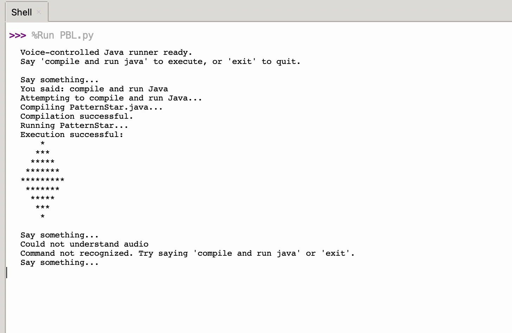

# 🎤 Voice-Controlled Java Compiler (Python Project)

## 📌 Description
A Python-based application that allows users to compile and run Java programs using voice commands, enabling a hands-free coding experience.

## 🚀 Features
- Voice command recognition  
- Compile Java programs using speech  
- Run Java code without manual input  
- Improves accessibility and productivity  

## 🛠️ Tech Stack
- Language: Python  
- Libraries: Speech Recognition  
- Integration: Java Compiler  

## ▶️ How to Run
1. Install required Python libraries  
2. Run the Python script  
3. Use voice commands to compile and run Java programs  

## 📈 Future Improvements
- Add graphical user interface  
- Support multiple programming languages  
- Improve voice recognition accuracy

## 📸 Output Screenshot

